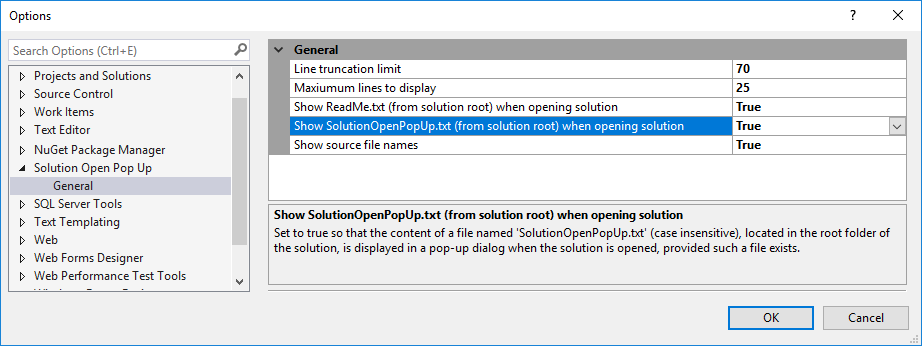

[AppVeyorProjectUrl]: https://ci.appveyor.com/project/GregTrevellick/solutionopenpopup
[AppVeyorProjectBuildStatusBadgeSvg]: https://ci.appveyor.com/api/projects/status/ap87wkdaam6jkgui?svg=true
[GitHubRepoURL]: https://github.com/GregTrevellick/SolutionOpenPopUp
[GitHubRepoIssuesURL]: https://github.com/GregTrevellick/SolutionOpenPopUp/issues
[GitHubRepoPullRequestsURL]: https://github.com/GregTrevellick/SolutionOpenPopUp/pulls
[VersionNumberBadgeURL]: https://vsmarketplacebadge.apphb.com/version/GregTrevellick.SolutionOpenPopUp.svg
[VisualStudioURL]: https://www.visualstudio.com/
[VSMarketplaceUrl]: https://marketplace.visualstudio.com/items?itemName=GregTrevellick.SolutionOpenPopUp
[VSMarketplaceReviewsUrl]: https://marketplace.visualstudio.com/items?itemName=GregTrevellick.SolutionOpenPopUp#review-details
[CharityWareURL]: https://github.com/GregTrevellick/MiscellaneousArtefacts/wiki/Charity-Ware
[WhyURL]: https://github.com/GregTrevellick/MiscellaneousArtefacts/wiki/Why

# Solution Open Pop Up

<!--BadgesSTART-->

<!-- Powered by https://github.com/GregTrevellick/ReadMeSynchronizer -->

<!--BadgesEND-->

[][VSMarketplaceUrl]

Download this extension from the [VS Marketplace][VSMarketplaceUrl].

---------------------------------------

<!--COPY START FOR VS GALLERY-->

Display the contents of certain text files in a solution folder in a pop-up when the solution is opened.

If a file called SolutionOpenPopUp.txt and/or ReadMe.txt exists in the root folder of the solution, the contents are shown in a pop-up when the solution is open - a handy way to share solution-specific gotchas, non-critical team messages, etc with colleagues and contributors. 

 - *If you LIKE this ***FREE*** extension please give a star rating below, it only takes a few seconds*.

 - *If you LOVE this ***FREE*** extension please [help others][CharityWareURL].*

## Use-Cases

Use this extension anytime you want to see, or you want others to see, certain information when a solution is opened. As you cannot gaurantee other users will have this extension installed you should not rely on this extension to convey critical information.

For example:

 - You're new to a company, have made some notes on a .Net solution, and it would be useful to see the notes each time you open the solution.

 - You are planning to upgrade a solution to VS2017 in the next quarter, and you want to give the developers a heads up whenever they open the solution.

 - The solution has some 'gotchas' (e.g. compilation, runtime or unit test related) which interested parties would benefit from seeing whenever they open up the code.  

 - The solution is simply a proof of concept and you wish to convey this to others.
 
 - Your solution has its' own "ReadMe" file which all developers should view when they open the solution.
 
 - You want to share a joke-of-the-day or coder-of-the-week announcement with colleagues.

[Why build this extension?][WhyURL] 

## Features

- Option to show/hide the content of SolutionOpenPopUp.txt in root folder of the solution in a pop-up when the solution is open.

- Option to show/hide the content of ReadMe.txt in root folder of the solution in a pop-up when the solution is open.

- Excessively long lines of text are truncated according to a user-defined value.

- User-defined limit for maximum number of lines to be shown in pop-up.

- If maximum lines limit is exceeded and multiple files are being displayed, the content of each file is truncated pro-rata.

- Option to show/hide source file names in the pop-up.

<!--COPY END FOR VS GALLERY-->

## Contribute

Contributions to this project are welcome by raising an [Issue][GitHubRepoIssuesURL] or submitting a [Pull Request][GitHubRepoPullRequestsURL].

## License

[MIT](/LICENSE.txt)

## Credits

The following authors / articles deserve special mention for their help whilst creating this extension:

[Ben](https://stackoverflow.com/questions/36035176/build-vs-2015-extension-on-build-server-without-vs-installed/43934701#43934701)

[Mads Kristensen](https://channel9.msdn.com/Events/Build/2016/B886)

[Joshua Thompson](http://schmalls.com/2015/01/19/adventures-in-visual-studio-extension-development-part-2)

[Slaks.Blog](http://blog.slaks.net/2013-11-10/extending-visual-studio-part-2-core-concepts/)

[][VSMarketplaceUrl]
